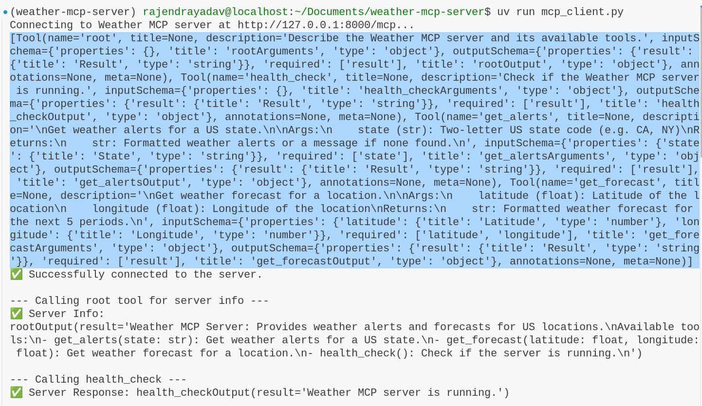

Weather MCP Server
==================

A Model Context Protocol (MCP) server that provides real-time weather alerts and forecasts for US locations using the National Weather Service (NWS) API.

Features
--------

- **Weather Alerts**: Get active weather alerts for any US state (e.g., severe weather, flood warnings, fire weather, etc.).
- **Weather Forecasts**: Retrieve detailed weather forecasts for any latitude/longitude in the US (up to 5 periods ahead).
- **Health Check**: Simple tool to verify the server is running.
- **MCP Root Tool**: Describes the server and available tools for easy discovery.

Requirements
------------

- Python 3.13+
- `uv <https://github.com/astral-sh/uv>`_ (for fast dependency management)
- fastmcp>=2.11.0
- httpx>=0.28.1
- mcp[cli]>=1.12.3

Installation
------------

1. **Clone the repository:**

   .. code-block:: bash

      git clone https://github.com/rajendrakumaryadav/weather-mcp-server.git
      cd weather-mcp-server

2. **Install dependencies:**

   .. code-block:: bash

      uv pip install -r requirements.txt
      # or, if using pyproject.toml:
      uv pip install -r <(uv pip compile pyproject.toml)

   Or, if you use another tool, ensure you have the dependencies from ``pyproject.toml`` installed.

Project Structure
-----------------

- ``main.py`` — MCP server implementation and tool definitions
- ``mcp_client.py`` — Example async client for interacting with the server
- ``pyproject.toml`` — Project metadata and dependencies
- ``.vscode/mcp.json`` — VS Code MCP server configuration (optional)
- ``resources/`` — Visual guides and setup screenshots

Usage
-----

Run the MCP Server
~~~~~~~~~~~~~~~~~~

.. code-block:: bash

   uv run main.py

Interact with the Server Using the Example Client
~~~~~~~~~~~~~~~~~~~~~~~~~~~~~~~~~~~~~~~~~~~~~~~~

The repository includes an example async client in ``mcp_client.py`` that demonstrates how to connect to the server and call its tools:

.. code-block:: bash

   uv run mcp_client.py

The client will:

- List available tools
- Call the ``root`` tool to get server info
- Call the ``health_check`` tool
- Call the ``get_alerts`` tool for California (CA)
- Call the ``get_forecast`` tool for Los Angeles (34.0522, -118.2437)

You should see output similar to:

.. code-block:: text

   uv run mcp_client.py 
   Connecting to Weather MCP server at http://127.0.0.1:8000/mcp...
   [Tool(name='root', title=None, description='Describe the Weather MCP server and its available tools.', inputSchema={'properties': {}, 'title': 'rootArguments', 'type': 'object'}, outputSchema={'properties': {'result': {'title': 'Result', 'type': 'string'}}, 'required': ['result'], 'title': 'rootOutput', 'type': 'object'}, annotations=None, meta=None), Tool(name='health_check', title=None, description='Check if the Weather MCP server is running.', inputSchema={'properties': {}, 'title': 'health_checkArguments', 'type': 'object'}, outputSchema={'properties': {'result': {'title': 'Result', 'type': 'string'}}, 'required': ['result'], 'title': 'health_checkOutput', 'type': 'object'}, annotations=None, meta=None), Tool(name='get_alerts', title=None, description='\nGet weather alerts for a US state.\n\nArgs:\n    state (str): Two-letter US state code (e.g. CA, NY)\nReturns:\n    str: Formatted weather alerts or a message if none found.\n', inputSchema={'properties': {'state': {'title': 'State', 'type': 'string'}}, 'required': ['state'], 'title': 'get_alertsArguments', 'type': 'object'}, outputSchema={'properties': {'result': {'title': 'Result', 'type': 'string'}}, 'required': ['result'], 'title': 'get_alertsOutput', 'type': 'object'}, annotations=None, meta=None), Tool(name='get_forecast', title=None, description='\nGet weather forecast for a location.\n\nArgs:\n    latitude (float): Latitude of the location\n    longitude (float): Longitude of the location\nReturns:\n    str: Formatted weather forecast for the next 5 periods.\n', inputSchema={'properties': {'latitude': {'title': 'Latitude', 'type': 'number'}, 'longitude': {'title': 'Longitude', 'type': 'number'}}, 'required': ['latitude', 'longitude'], 'title': 'get_forecastArguments', 'type': 'object'}, outputSchema={'properties': {'result': {'title': 'Result', 'type': 'string'}}, 'required': ['result'], 'title': 'get_forecastOutput', 'type': 'object'}, annotations=None, meta=None)]
   ✅ Successfully connected to the server.

   --- Calling root tool for server info ---
   ✅ Server Info:
   rootOutput(result='Weather MCP Server: Provides weather alerts and forecasts for US locations.\nAvailable tools:\n- get_alerts(state: str): Get weather alerts for a US state.\n- get_forecast(latitude: float, longitude: float): Get weather forecast for a location.\n- health_check(): Check if the server is running.\n')

   --- Calling health_check ---
   ✅ Server Response: health_checkOutput(result='Weather MCP server is running.')

   --- Calling get_alerts for California (CA) ---
   ✅ Server Response:
   get_alertsOutput(result='\nEvent: Extreme Heat Warning\nArea: San Gorgonio Pass Near Banning\nSeverity: Severe\nDescription: * WHAT...Dangerously hot conditions with temperatures up to 114.\n\n* WHERE...San Gorgonio Pass near Banning.\n\n* WHEN...Until 8 PM PDT Friday.\n\n* IMPACTS...Heat related illnesses increase significantly during\nextreme heat events.\nInstructions: Drink plenty of fluids, stay in an air-conditioned room, stay out of\nthe sun, and check up on relatives and neighbors.\n\n---\n\nEvent: Heat Advisory\nArea: San Bernardino and Riverside County Valleys-The Inland Empire\nSeverity: Moderate\nDescription: * WHAT...Temperatures up to 106.\n\n* WHERE...San Bernardino and Riverside County Valleys-The Inland\nEmpire.\n\n* WHEN...Until 8 PM PDT Friday.\n\n* IMPACTS...Hot temperatures may cause heat illnesses.\nInstructions: Drink plenty of fluids, stay in an air-conditioned room, stay out of\nthe sun, and check up on relatives and neighbors.\n\n---\n\nEvent: Heat Advisory\nArea: San Bernardino County Mountains\nSeverity: Moderate\nDescription: * WHAT...Temperatures up to 96 below 5500 feet.\n\n* WHERE...San Bernardino County Mountains.\n\n* WHEN...Until 8 PM PDT Friday.\n\n* IMPACTS...Hot temperatures may cause heat illnesses.\nInstructions: Drink plenty of fluids, stay in an air-conditioned room, stay out of\nthe sun, and check up on relatives and neighbors.\n\n---\n\nEvent: Heat Advisory\nArea: Santa Ana Mountains and Foothills; Orange County Inland\nSeverity: Moderate\nDescription: * WHAT...Temperatures up to 95.\n\n* WHERE...Orange County Inland Areas and Santa Ana Mountains and\nFoothills.\n\n* WHEN...Until 8 PM PDT Friday.\n\n* IMPACTS...Hot temperatures may cause heat illnesses.\nInstructions: Drink plenty of fluids, stay in an air-conditioned room, stay out of\nthe sun, and check up on relatives and neighbors.\n\n---\n\nEvent: Heat Advisory\nArea: Riverside County Mountains; San Diego County Mountains\nSeverity: Moderate\nDescription: * WHAT...Temperatures up to 100.\n\n* WHERE...Riverside County Mountains and San Diego County Mountains.\n\n* WHEN...Until 8 PM PDT Friday.\n\n* IMPACTS...Hot temperatures may cause heat illnesses.\nInstructions: Drink plenty of fluids, stay in an air-conditioned room, stay out of\nthe sun, and check up on relatives and neighbors.\n\n---\n\nEvent: Heat Advisory\nArea: San Diego County Inland Valleys\nSeverity: Moderate\nDescription: * WHAT...Temperatures up to 102 for the inland valleys.\n\n* WHERE...San Diego County Valleys.\n\n* WHEN...Until 8 PM PDT Friday.\n\n* IMPACTS...Hot temperatures may cause heat illnesses.\nInstructions: Drink plenty of fluids, stay in an air-conditioned room, stay out of\nthe sun, and check up on relatives and neighbors.\n\n---\n\nEvent: Extreme Heat Warning\nArea: Coachella Valley; San Diego County Deserts\nSeverity: Severe\nDescription: * WHAT...Dangerously hot conditions with temperatures up to 118.\n\n* WHERE...Coachella Valley and San Diego County Deserts.\n\n* WHEN...Until 8 PM PDT Friday.\n\n* IMPACTS...Heat related illnesses increase significantly during\nextreme heat events.\nInstructions: Drink plenty of fluids, stay in an air-conditioned room, stay out of\nthe sun, and check up on relatives and neighbors.\n\nDo not leave young children and pets in unattended vehicles. Car\ninteriors will reach lethal temperatures in a matter of minutes.\n\n---\n\nEvent: Extreme Heat Warning\nArea: Parker Valley; Kofa; Yuma; Central La Paz; Southeast Yuma County; Gila River Valley; Joshua Tree NP West; Joshua Tree NP East; Imperial County Southwest; Salton Sea; Chuckwalla Mountains; Imperial County Southeast; Imperial County West; Imperial Valley; Chiriaco Summit; Palo Verde Valley; Chuckwalla Valley\nSeverity: Severe\nDescription: * WHAT...Dangerously hot conditions. Afternoon temperatures 106 to\n118 degrees. Major Heat Risk.\n\n* WHERE...Portions of southwest Arizona and southeast and southern\nCalifornia.\n\n* WHEN...Until 8 PM MST /8 PM PDT/ Friday.\n\n* IMPACTS...Heat related illnesses increase significantly during\nextreme heat events. Increase in heat related illnesses, including\nheat cramps, heat exhaustion, and heat stroke. Heat stroke can\nlead to death.\nInstructions: An Extreme Heat Warning means that a period of very hot\ntemperatures, even by local standards, will occur. Actions should be\ntaken to lessen the impact of the extreme heat.\n\nTake extra precautions if you work or spend time outside. When\npossible, reschedule strenuous activities to early morning or\nevening. Know the signs and symptoms of heat exhaustion and heat\nstroke. Wear lightweight and loose-fitting clothing when possible\nand drink plenty of water.\n\nTo reduce risk during outdoor work, the Occupational Safety and\nHealth Administration recommends scheduling frequent rest breaks in\nshaded or air conditioned environments. Anyone overcome by heat\nshould be moved to a cool and shaded location. Heat stroke is an\nemergency! Call 9 1 1.\n\nPublic cooling shelters are available in some areas. Consult county\nofficials for more details.\n\n---\n\nEvent: Extreme Heat Warning\nArea: Lake Havasu and Fort Mohave; Northwest Deserts; Lake Mead National Recreation Area; Morongo Basin; Cadiz Basin; San Bernardino County-Upper Colorado River Valley; Lake Mead National Recreation Area\nSeverity: Severe\nDescription: * WHAT...Dangerously hot conditions with high temperatures around\n105 in Kingman, Golden Valley, and Dolan Springs; around 115 in\nLaughlin, Bullhead City, Needles, and Lake Havasu City; and near\n110 in the Morongo Basin and Twentynine Palms. Major Heat Risk.\n\n* WHERE...Lake Mead National Recreation Area, Lake Havasu and Fort\nMohave, Northwest Deserts, Morongo Basin, Cadiz Basin, and San\nBernardino County-Upper Colorado River Valley.\n\n* WHEN...Until 8 PM PDT /8 PM MST/ Thursday.\n\n* IMPACTS...Heat-related illnesses increase significantly during\nextreme heat events.\nInstructions: Drink plenty of fluids, stay in an air-conditioned room, stay out of\nthe sun, and check up on relatives and neighbors.\n\nDo not leave young children and pets in unattended vehicles. Car\ninteriors will reach lethal temperatures in a matter of minutes.\n\nTake extra precautions when outside. Wear lightweight and loose\nfitting clothing. Try to limit strenuous activities to early morning\nor evening. Take action when you see symptoms of heat exhaustion and\nheat stroke.\n\nTo reduce risk during outdoor work, the Occupational Safety and\nHealth Administration recommends scheduling frequent rest breaks in\nshaded or air conditioned environments. Anyone overcome by heat\nshould be moved to a cool and shaded location. Heat stroke is an\nemergency! Call 9 1 1.\n')

   --- Calling get_forecast for Los Angeles (34.05, -118.24) ---
   ✅ Server Response:
   get_forecastOutput(result='\nToday:\nTemperature: 91°F\nWind: 5 to 10 mph SW\nForecast: Patchy fog before 11am. Mostly sunny, with a high near 91. Southwest wind 5 to 10 mph.\n\n---\n\nTonight:\nTemperature: 63°F\nWind: 0 to 5 mph SSW\nForecast: Mostly clear, with a low around 63. South southwest wind 0 to 5 mph.\n\n---\n\nFriday:\nTemperature: 88°F\nWind: 0 to 10 mph SSW\nForecast: Sunny, with a high near 88. South southwest wind 0 to 10 mph.\n\n---\n\nFriday Night:\nTemperature: 65°F\nWind: 0 to 10 mph S\nForecast: Mostly clear, with a low around 65. South wind 0 to 10 mph.\n\n---\n\nSaturday:\nTemperature: 86°F\nWind: 0 to 10 mph SSW\nForecast: Sunny, with a high near 86. South southwest wind 0 to 10 mph.\n')
   ...

Available Tools
~~~~~~~~~~~~~~~

- ``get_alerts(state: str)``
  - Get weather alerts for a US state (e.g., ``CA``, ``NY``, ``AL``).
- ``get_forecast(latitude: float, longitude: float)``
  - Get weather forecast for a specific location (e.g., San Francisco: ``37.7749, -122.4194``).
- ``health_check()``
  - Check if the server is running.
- ``root()``
  - Describe the server and its available tools.

API Reference
-------------

.. list-table::
   :header-rows: 1

   * - Tool
     - Arguments
     - Returns
   * - get_alerts
     - state: str
     - Formatted weather alerts for the given US state code
   * - get_forecast
     - latitude: float, longitude: float
     - Formatted weather forecast for the given coordinates (next 5 periods)
   * - health_check
     - None
     - Simple message indicating the server is running
   * - root
     - None
     - Describes the server and lists available tools

Walkthrough: How to Use and Configure
-------------------------------------

Below are visual of running MCP client:

   **Running MCP with MCP client**

   This image shows how to set up the MCP client from the command line.

License
-------

MIT License. See ``LICENSE`` for details.

Acknowledgments
---------------

- `National Weather Service API <https://www.weather.gov/documentation/services-web-api>`_
- `fastmcp <https://gofastmcp.com/getting-started/welcome>`_
- `httpx <https://www.python-httpx.org/>`_
- `MCP Protocol <https://modelcontextprotocol.io/overview>`_
- `Build an MCP Server <https://modelcontextprotocol.io/quickstart/server>`_