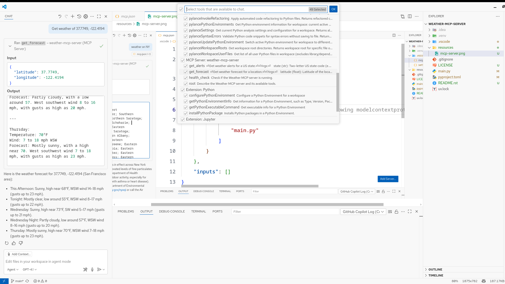
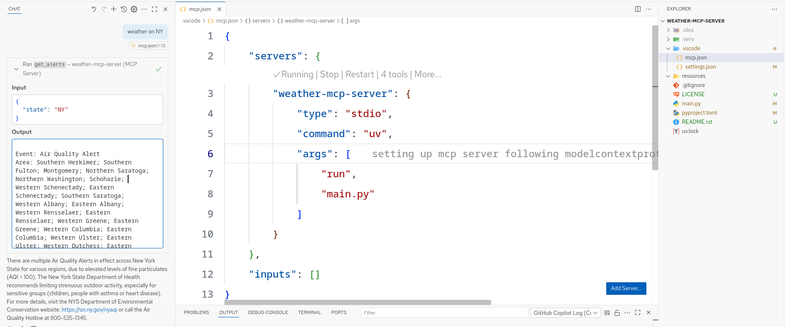
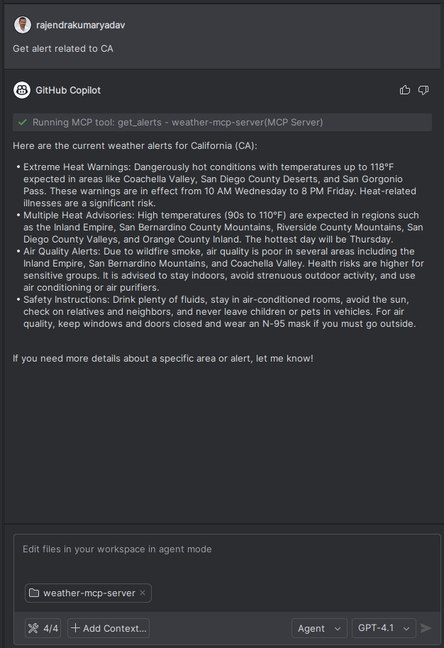

Weather MCP Server
==================

A Model Context Protocol (MCP) server that provides real-time weather alerts and forecasts for US locations using the National Weather Service (NWS) API.

Features
--------

- **Weather Alerts**: Get active weather alerts for any US state (e.g., severe weather, flood warnings, fire weather, etc.).
- **Weather Forecasts**: Retrieve detailed weather forecasts for any latitude/longitude in the US (up to 5 periods ahead).
- **Health Check**: Simple tool to verify the server is running.
- **MCP Root Tool**: Describes the server and available tools for easy discovery.

Requirements
------------

- Python 3.13+
- `uv <https://github.com/astral-sh/uv>`_ (for fast dependency management)

Installation
-------------

1. **Clone the repository:**

   .. code-block:: bash

      git clone https://github.com/rajendrakumaryadav/weather-mcp-server.git
      cd weather-mcp-server

2. **Install dependencies:**

   .. code-block:: bash

      uv pip install -r requirements.txt
      # or, if using pyproject.toml:
      uv pip install -r <(uv pip compile pyproject.toml)

   Or, if you use another tool, ensure you have the dependencies from ``pyproject.toml`` installed:

   - fastmcp>=2.11.0
   - httpx>=0.28.1
   - mcp[cli]>=1.12.3

Walkthrough: How to Use and Configure
-------------------------------------

Below are visual guides to help you get started with the Weather MCP Server:

   **How to use the Weather MCP Server**
   
   This image shows how to configure the MCP server in your environment, such as setting up the server in VS Code or using the provided configuration files.

   **MCP Server Configuration Example**

   This image demonstrates the basic usage flow for interacting with the server, including sending requests and receiving weather data.

   **MCP Server Setup in PyCharm**

   This image shows how to set up the MCP server in the PyCharm IDE.

Usage
-----

Run the MCP Server
~~~~~~~~~~~~~~~~~~

.. code-block:: bash

   uv run main.py

Or, if using VS Code with the provided ``.vscode/mcp.json`` configuration, you can start the server using the MCP extension or command palette.

Available Tools
~~~~~~~~~~~~~~~

- ``get_alerts(state: str)``
  - Get weather alerts for a US state (e.g., ``CA``, ``NY``, ``AL``).
- ``get_forecast(latitude: float, longitude: float)``
  - Get weather forecast for a specific location (e.g., San Francisco: ``37.7749, -122.4194``).
- ``health_check()``
  - Check if the server is running.
- ``root()``
  - Describe the server and its available tools.

Project Structure
-----------------

- ``main.py`` — MCP server implementation and tool definitions
- ``pyproject.toml`` — Project metadata and dependencies
- ``.vscode/mcp.json`` — VS Code MCP server configuration

API Reference
-------------

get_alerts(state: str) → str
  Returns formatted weather alerts for the given US state code.

get_forecast(latitude: float, longitude: float) → str
  Returns a formatted weather forecast for the given coordinates (next 5 periods).

health_check() → str
  Returns a simple message indicating the server is running.

root() → str
  Describes the server and lists available tools.

License
-------

MIT License. See ``LICENSE`` for details.

Acknowledgments
---------------

- `National Weather Service API <https://www.weather.gov/documentation/services-web-api>`_
- `fastmcp <https://gofastmcp.com/getting-started/welcome>`_
- `httpx <https://www.python-httpx.org/>`_
- `MCP Protocol <https://modelcontextprotocol.io/overview>`_
- `Build an MCP Server <https://modelcontextprotocol.io/quickstart/server>`_